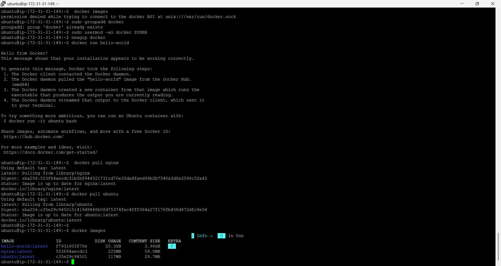
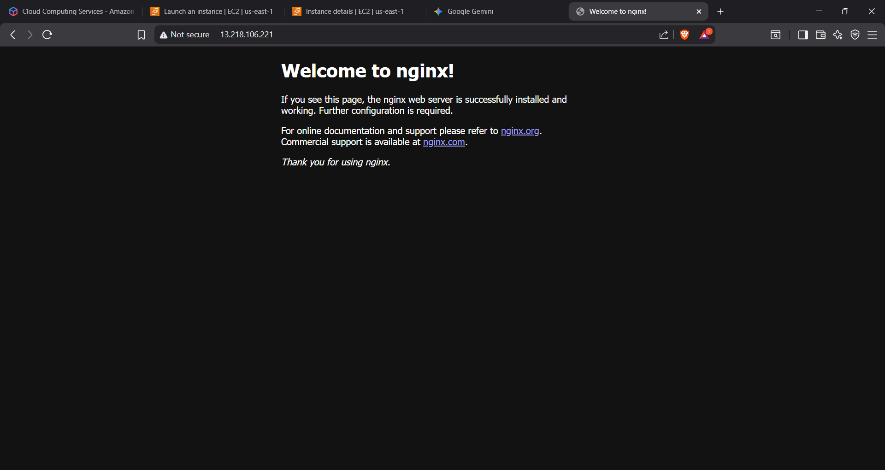
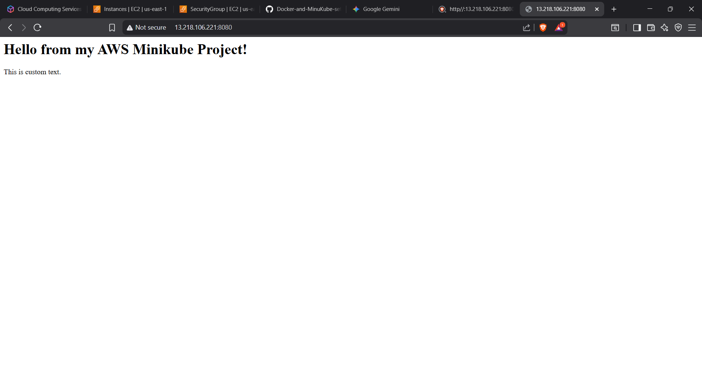
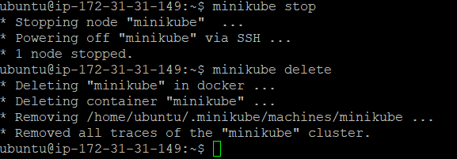

# AWS Minikube Web Deployment Project

## Project Overview

### This project elucidates the deployment methodology for a web application utilizing Docker and Minikube (Kubernetes) hosted on an AWS EC2 Ubuntu instance. The primary objective was the simulation of a realistic development environment wherein container orchestration is performed on a remote cloud server, as opposed to a local machine. This configuration necessitated the resolution of specific challenges regarding cloud networking constraints, the management of limited container storage on free-tier infrastructure, and the secure exposure of a private Kubernetes service to the public internet via port forwarding tunnels.

# Infrastructure

### Cloud Provider: AWS (EC2) - Selected to simulate a production-grade remote server environment.

### Operating System: Ubuntu 24.04 LTS  - Chosen for its extensive compatibility with container runtimes.

### Container Engine: Docker - Functions as the underlying driver for the Kubernetes cluster.

### Orchestration: Minikube (Kubernetes) - Provides a lightweight, single-node cluster environment optimal for educational and testing purposes.

### Web Server: Nginx - Utilized as a reliable, lightweight web server for connectivity verification.

# Step 1: Environment Setup & Docker Configuration

The initial configuration phase necessitated the adjustment of Linux user privileges. By default, the Docker daemon operates with `root` privileges, typically requiring the use of `sudo` for all commands. To optimize the workflow and adhere to industry best practices, system group modifications were implemented to permit the `ubuntu` user to interact directly with the Docker daemon.

## Commands Executed:

### Create the docker group if it doesn't exist
`sudo groupadd docker`

### Add the current user to the docker group
`sudo usermod -aG docker $USER`

### Refresh the group membership without logging out
`newgrp docker`

Verification:
The command `docker run hello-world` was executed. This verification step was critical to confirm the activity of the Docker daemon, the correct application of socket permissions, and the instance's ability to successfully pull images from Docker Hub.

# Step 2: Docker Networking Verification

Prior to the initialization of the Kubernetes cluster, a preliminary network verification was conducted to assess the basic networking layer. This process involved the deployment of a standalone Nginx container on Port 80 to verify that the AWS Security Groups (firewall rules) were correctly configured to permit inbound HTTP traffic from the public internet. Failure at this stage would have precluded subsequent access to any Kubernetes services.

## Commands Executed:

`docker run -d -p 80:80 --name test-web nginx`

Result:
The default "Welcome to Nginx" page was successfully accessed via the EC2 instance's Public IP, thereby confirming that the cloud firewall was permeable and the instance was reachable.

# Step 3: Minikube Cluster Initialization

A single-node Kubernetes cluster was initialized utilizing the Docker driver. This approach effectively encapsulates Kubernetes within Docker containers, circumventing the requirement for complex VM hypervisors on the cloud instance.

Note: `The --force` flag was mandatorily applied in this instance. The AWS Free Tier `t2.micro` instance possesses limited disk storage (approximately 8GB), which frequently falls below the recommended hardware specifications for Minikube. The force flag overrides this constraint, permittig the cluster to initialize.

## Commands Executed:

`minikube start --driver=docker --force`
`kubectl get nodes`

# Step 4: Kubernetes Deployment & Port Forwarding

This phase encompassed the core deployment logic, wherein Nginx was deployed as a Pod within the cluster. A "live edit" of the `index.html` file was performed within the active container to display custom content, demonstrating the successful serving of a unique application.

To facilitate access to the internal Minikube network from the public internet, the `kubectl port-forward` command was utilized. Crucially, the `--address 0.0.0.0` flag was appended. By default, port forwarding binds exclusively to `localhost` (127.0.0.1), which would restrict access solely to the EC2 instance. Binding to `0.0.0.0` configures the listener on all interfaces, thereby permitting the tunnel to accept traffic from external sources, such as a local workstation.

## Commands Executed:

# 1. Create Deployment
# Instructs Kubernetes to pull the Nginx image and maintain a running pod.
`kubectl create deployment my-project --image=nginx`

# 2. Expose Service
# Creates a Service object to provide a stable internal IP for the Nginx pod.
`kubectl expose deployment my-project --type=NodePort --port=80`

# 3. Modify Content (Live Edit)
# Directly executes a shell command inside the pod to overwrite the default index page.
`kubectl exec [POD_NAME] -- sh -c 'echo "<h1>Hello from my AWS Minikube Project!</h1>
This is custom text.
" > /usr/share/nginx/html/index.html'`

# 4. Tunnel Traffic
# Opens a tunnel from the EC2 port 8080 to the internal Kubernetes port 80.
# The 0.0.0.0 address is vital for external access.
`kubectl port-forward service/my-project 8080:80 --address 0.0.0.0`

# Step 5: Final Result

Access to the application was successfully established via `http://<EC2-PUBLIC-IP>:8080`. The browser rendered the custom modified web page ("Hello from my AWS Minikube Project!"), confirming the successful routing of traffic from the local machine, through the AWS network, into the EC2 instance, and finally tunneling into the private Kubernetes pod.

# Step 6: Cleanup & Resource Management

To mitigate unnecessary cloud infrastructure costs and reclaim disk storage, a rigorous cleanup of the environment was executed. Given the limited storage capacity of the `t2.micro` instance, the retention of stopped containers or unused images poses a significant risk of disk saturation (precipitating the "99% capacity" error previously encountered).

## Commands Executed:

# Stops the running cluster to conserve CPU resources
`minikube stop`

# Deletes the cluster VM/container to free up disk space
`minikube delete`
# Aggressively removes all unused Docker data, including volumes, to reset the environment
docker system prune -a --volumes -f
